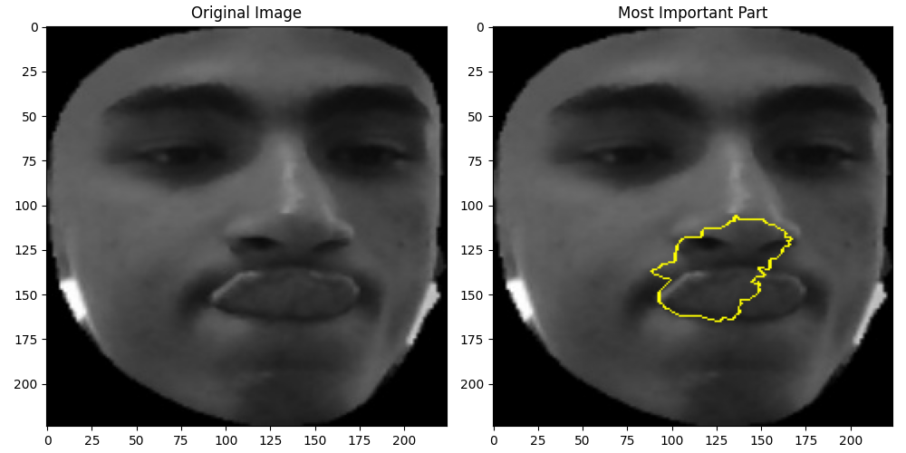

# Lime with Vision in transformers (VIT)

This project explores the integration of VIT with Lime, an interpretability tool that works with machine and deep learning. The goal is to visualize what area of the image were most important for the model to make it's prediction thus understanding more. enhancing trust in AI models.

# Project Overview

-  **Goal**: Visualize why the model predicted a specific emotion for an input image.
-  **Model**: Fine-tuned Vision Transformer (`dima806/facial_emotions_image_detection` from Hugging Face).
-  **Tech Stack**: PyTorch, Hugging Face Transformers, LIME, PIL, matplotlib.

# Files Structure
`imetesting.py`: main code to use LIME with VIT
`facial_expression_VIT model/`: The fine-tuned ViT model (not included in the repo due to size — add your own).
`requirements.txt`: Python dependencies.

there are 3 images that were used to test the code and three images with the result of the test 

facial expressions tested: 
happy
angry
tongue out


##  How to Run

1. Clone the repository.
2. Install dependencies:

    ```bash
    pip install -r requirements.txt
    ```
3. change the model to your model and change the class names (the performance of LIME heavily depends on your model performance)

4. run the code and enter the path of the image you will test on

## Example Output

Original image:


LIME explanation:




## Contributing

Contributions are welcome! Please fork the repository and submit a pull request.

## License

This project is licensed under the [MIT License](LICENSE).

## Acknowledgments

- [Lime](https://github.com/marcotcr/lime) for interpretability tools.
- Open-source libraries for facial expression analysis.
